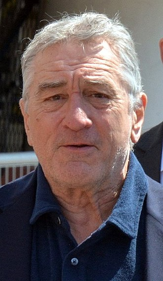

# Robert de Niro

Robert Anthony De Niro Jr., born August 17, 1943, is an American actor, producer, and director. He is particularly known for his work in crime films, thrillers and collaborations with filmmaker Martin Scorsese.

## Traits

* Convincing
* Flexible
* Experienced
* Old

As Robert de Niro said:

> When I was around 18. I was looking at a TV show [...] and I said if these actors are making a living at it, and they’re not really that good, I can’t do any worse than them.

